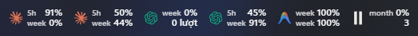
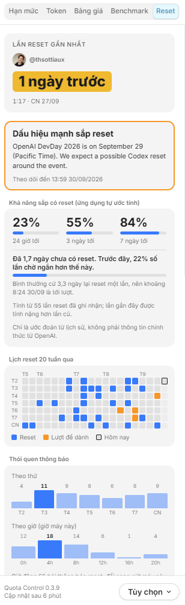

<p align="center"></p>

# Quota Control

AI usage limits, reset countdowns and token history in your Windows/Linux system tray or macOS menu bar.

## Preview

https://github.com/user-attachments/assets/05afff30-24bb-41df-a1bd-a7db58bdaac7

**Usage at a glance in the system tray**



<details>
<summary>Reset dashboard</summary>

<p></p>

</details>

## Installation

[Download the latest release](https://github.com/buidangminh23/quota-control/releases/latest), or use the commands below.

### Windows (x64)

Run in **PowerShell** to download and open the latest installer:

```powershell
$release = Invoke-RestMethod 'https://api.github.com/repos/buidangminh23/quota-control/releases/latest' -ErrorAction Stop
$asset = $release.assets | Where-Object name -Like '*_x64-setup.exe'
Invoke-WebRequest $asset.browser_download_url -OutFile "$env:TEMP\quota-control-setup.exe" -ErrorAction Stop
Start-Process "$env:TEMP\quota-control-setup.exe"
```

Installs for the current user. The installer is not code-signed; Windows SmartScreen may ask for confirmation.

### macOS (Apple Silicon, macOS 14+)

```sh
curl -fsSL https://raw.githubusercontent.com/buidangminh23/quota-control/main/scripts/install-macos.sh | bash
```

Downloads the latest release, verifies its SHA-256 checksum, installs the app and opens it.
For a manual install, download the `.dmg` and drag **Quota Control** to **Applications**.
The app is not notarized by Apple; a browser download may require **System Settings → Privacy & Security → Open Anyway**.

### Linux (x64)

The commands below require [GitHub CLI](https://cli.github.com/). Run them in a download folder.

**Ubuntu/Debian — `.deb`:**

```sh
gh release download --repo buidangminh23/quota-control --pattern '*_amd64.deb' --output quota-control.deb &&
sudo apt install ./quota-control.deb
```

**Other distributions — AppImage:**

```sh
gh release download --repo buidangminh23/quota-control --pattern '*_amd64.AppImage' --output quota-control.AppImage &&
chmod +x quota-control.AppImage &&
./quota-control.AppImage
```

A desktop with system tray support is recommended. If FUSE is unavailable, run `APPIMAGE_EXTRACT_AND_RUN=1 ./quota-control.AppImage`.

## Features

- Claude, Codex, Cursor, Copilot and many other AI services in one dashboard.
- Account limits, credits and reset countdowns, depending on what each service exposes.
- Local token history and estimated API-equivalent costs, separate from subscription charges.
- Quota notifications, a global shortcut and automatic update checks.
- Dynamic Island and desktop widgets on macOS.

## Get started

1. Open Quota Control from the system tray or menu bar.
2. Existing Claude Code and Codex CLI logins appear automatically. Use **Accounts → +** to connect other accounts with the methods offered for each service.
3. Choose the accounts and readings to display in **Customize** and **Settings**.

Use **Settings → App Updates → Check Now** to install a newer version. Updates are verified with the release signing key.

The backend runs locally; provider requests go to the relevant services. Local token history covers this computer only.

## Command line and API

`usagectl` is installed with the app. Open a new terminal after the first launch:

```sh
usagectl
usagectl claude
usagectl codex --force
```

The CLI returns JSON and works with the app closed. While the app runs, the local API is available at
`http://127.0.0.1:6736/v1/limits`. It allows requests from any origin, so local programs and web pages can read these limits.

## Development

Requires Rust, Node.js, pnpm and the [Tauri platform prerequisites](https://v2.tauri.app/start/prerequisites/).

```sh
pnpm install
pnpm tauri dev
```

Validate with `cargo test --workspace`, `pnpm test` and `pnpm build`. Build an installer on its target OS with `pnpm tauri build`.
See [scanner accounting](crates/uc-logscan/README.md) and [pricing provenance](crates/uc-pricing/README.md) for token and cost details.

## License and credits

[MIT](LICENSE). Based on [OpenUsage](https://github.com/robinebers/openusage) by Robin Ebers; port by Bui Dang Minh.
Quota Control is an independent, unofficial port and is not affiliated with or endorsed by OpenUsage's author.
